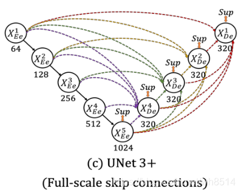
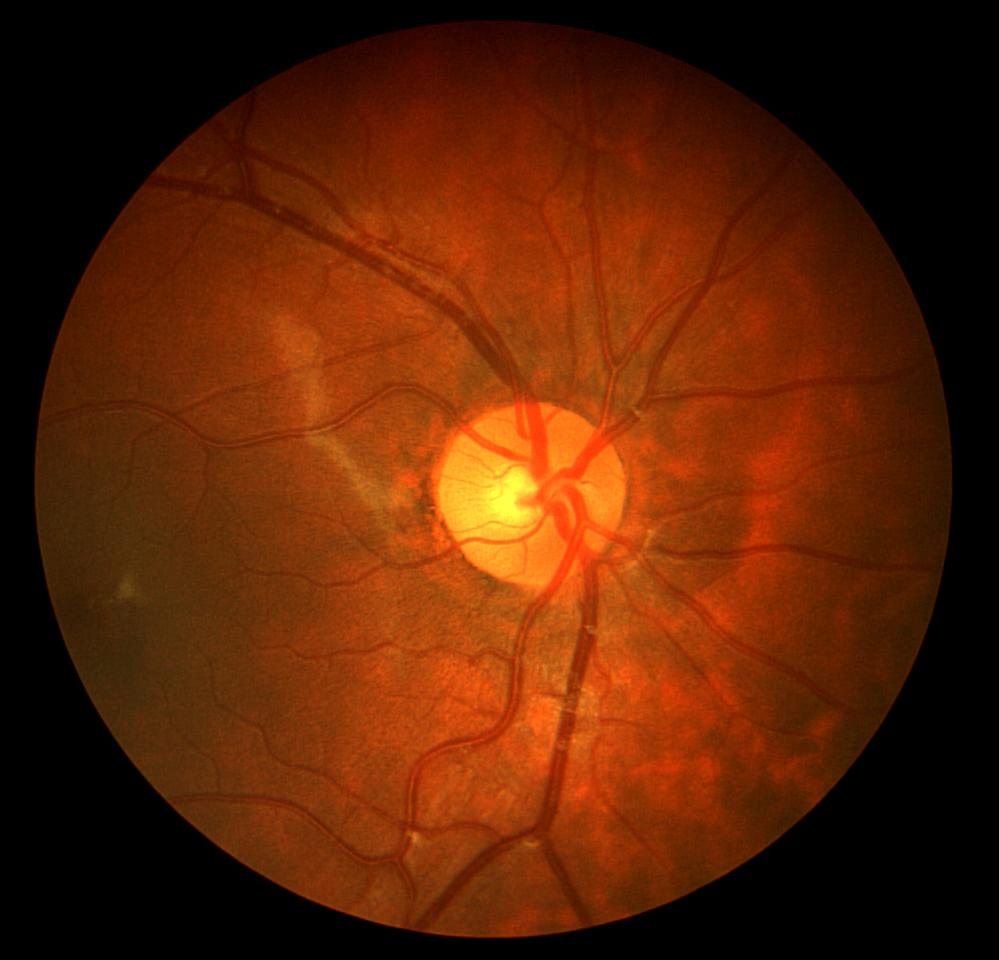
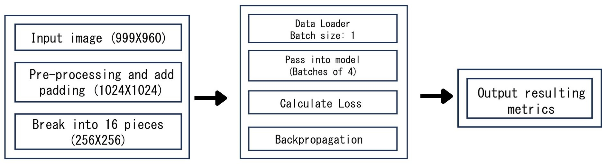

# Retinal Blood Vessel Segmentation with UNet3+
This project implements a UNet3+ model to perform segmentation of retinal blood vessels using the CHASE_DB1 dataset. The model leverages advanced digital image processing techniques for preprocessing, ensuring improved segmentation accuracy and better generalization across biomedical images.

### Description
<pre>
1. This project applies the UNet3+ model with dense skip connections and multi-scale feature aggregation.
2. The study shows how UNet3+ outperforms traditional segmentation models in accuracy and precision, highlighting its adaptability for biomedical image segmentation. 
</pre>

### Dataset
<pre>
1. Dataset: CHASE_DB1 dataset (28 high-resolution fundus images with manually annotated ground truths). 
2. Link: <a href="https://researchdata.kingston.ac.uk/96/">CHASE_DB1 Dataset Soucre</a>
</pre>

### Preprocessing and Data Augmentation
<pre>
1. Preprocessing Techniques: 
    - Green Channel Extraction: Enhances vessel visibility. 
    - Morphological Transformations: Suppresses background noise. 
    - Contrast Enhancement: Improves vessel visibility using CLAHE and Gamma Correction. 
    - Artifacts Reduction: Smooths noisy regions. 
2. Data Augmentation Strategies: 
    - Random Rotations 
    - Horizontal and Vertical Flipping
</pre>
 

### Model Architecture
<pre>
1. Model: UNet3+ 
2. Framework: PyTorch with GPU acceleration.
3. Hyperparameters: 
    - Learning Rate: 0.0001 
    - Batch Size: 1 (handled as 4 × 4 sub-images)
    - Epochs: 100 
    - Optimizer: AdamW 
</pre>

### Loss Functions
<pre>
1. BCE_Dice Loss: Balances pixel-wise accuracy with structural similarity. 
2. IoU_Sensitivity Loss: Addresses class imbalance and reduces false negatives. 
</pre>

### Model Performance
<pre>
1. Quantitative Metrics: 
- Accuracy: 97.9% 
- Sensitivity (Recall): 92.0% 
- Specificity: 98.2% 
- Dice Coefficient: 83.9% 
- IoU: 72.7% 
</pre>
